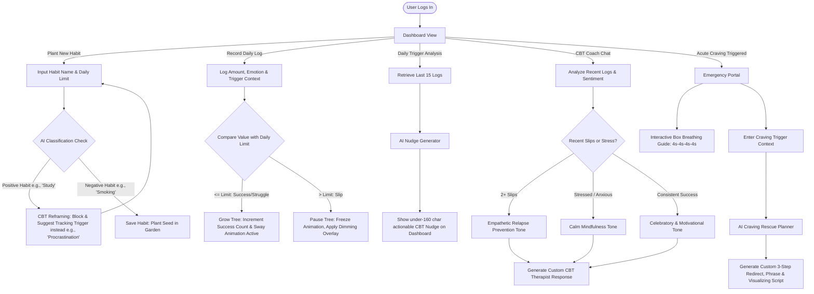

# 🌳 Rohi — Break Bad Habits & Recovery Garden

> **Scientific, CBT-Based Habit Recovery utilizing a Non-Punitive Virtual Garden and Generative AI Coaching**

Rohi is a production-grade web application designed to help users break bad habits and recover from addictive behaviors. Built on **Cognitive Behavioral Therapy (CBT)** principles, Rohi eliminates the psychological anxiety of punitive "streak resets" (which often trigger the abstinence violation effect) and replaces them with a virtual **Recovery Garden** that rewards persistent growth.

---

## 🔄 How It Works & Application Workflow

To understand the lifecycle of habit tracking, AI validation, and cognitive coaching, here is the complete end-to-end user workflow:



### Detailed Step-by-Step Process

1. **Intelligent Habit Seeding:**
   * When you create a habit, the system runs it through an AI model configured in [app.py](file:///d:/promptswar/habit_breaker/app.py#L446) to evaluate its behavioral type.
   * If it detects a positive target routine, it will return a `400 Bad Request` block with a CBT reframing guide (e.g., telling the user to focus tracking on the negative trigger action rather than the positive task).

2. **Daily Habit Evolution (Non-Punitive Garden):**
   * As daily logs are submitted via [dashboard.html](file:///d:/promptswar/habit_breaker/templates/dashboard.html#L158), the system categorizes logs into `Success`, `Struggle` (at limit), or `Slip` (exceeded limit).
   * **Growth State**: Successful days trigger tree growth through 6 unique visual stages (Seed ➔ Sprout ➔ Sapling ➔ Young Tree ➔ Mature Tree ➔ Blooming Tree) rendered dynamically via SVGs.
   * **Rest State**: If a user slips, the system doesn't reset successful days to `0`. It flags the plot as `paused-plot`, stops CSS sway animations, and applies a dim filter overlay, encouraging mindful recovery.

3. **Contextual AI Adjustments:**
   * The CBT companion app analyzes your emotional states and logs over your last 5 submissions.
   * If you've slipped, it adapts its response tone to be highly supportive, guiding you through a post-slip CBT relapse prevention session. If you've been doing well, it shifts to an affirming, celebratory coaching tone.

4. **Emergency Urge Surfing:**
   * When facing acute cravings, the emergency system in [emergency.html](file:///d:/promptswar/habit_breaker/templates/emergency.html) coordinates physical regulation (Box Breathing) and cognitive redirection (3-Step AI Craving Rescue plans matching your specific immediate trigger context).

---

## 🌟 Core Product Features

### 1. 🌳 The Recovery Garden (Growth-Paused Model)
Unlike traditional habit trackers that wipe out progress upon a single slip, Rohi uses a persistent growth mechanic:
*   **Progressive Development**: Success increments a persistent count, growing a custom visual tree through **6 stages** (Seed ➔ Sprout ➔ Sapling ➔ Young Tree ➔ Mature Tree ➔ Blooming Tree).
*   **Mindful Rest State**: If a user logs an activity exceeding their daily limit, their progress is **paused** rather than reset to zero. The tree enters a resting state—visual sway animations pause, and a warm overlay is applied—encouraging reflection instead of punishment.

### 2. 💬 Context-Aware CBT AI Coaching
*   An adaptive coach that utilizes user history (the last 5 activity logs) to tailor its responses.
*   If recent logs indicate slips, the AI shifts to a gentle relapse-prevention tone; if logs show feelings of stress or anxiety, it offers soothing mindfulness advice; if progress is steady, it celebrates milestones.
*   **High-Availability LLM Routing**: Primary chat runs on Google Gemini. If network issues occur, the system automatically falls back to Groq (`llama-3.3-70b-specdec`) via direct REST integration.

### 3. 🚨 Urge Surfing & Emergency Interventions
*   **Paced Box Breathing**: An interactive breathing visualizer (4s Inhale ➔ 4s Hold ➔ 4s Exhale ➔ 4s Hold) to help regulate heart rate variability during acute cravings.
*   **AI Craving Rescue**: Takes immediate user trigger context and generates a customized, 3-step reframing script on demand.

---

## 🛠️ Production-Grade Engineering

### 🔒 Enterprise Security
*   **CSRF Middleware**: Zero-dependency Cross-Site Request Forgery protection that checks session-based tokens on form submissions and JSON-based AJAX requests (via custom `X-CSRF-Token` headers).
*   **Stored XSS Protection**: Input sanitization utilizing HTML-escaping on all user strings before database write operations.
*   **Response Security Headers**: Enforces strict security configurations on all HTTP responses:
    *   `X-Frame-Options: DENY` (prevents clickjacking)
    *   `X-Content-Type-Options: nosniff` (prevents MIME type sniffing)
    *   `X-XSS-Protection: 1; mode=block` (activates browser XSS filters)
    *   Strict `Content-Security-Policy` limits on asset loading.
*   **Secure Session & Password Storage**: Passwords are saved as secure PBKDF2-HMAC-SHA256 hashes. User sessions feature permanent 2-hour session lifetime expirations.

### ⚡ Performance & Scalability
*   **N+1 Query Resolution**: Eliminates database round-trip latency by using SQLAlchemy eager relationship loading (`joinedload`) to fetch logs and habit associations in a single SQL `JOIN`.
*   **Server Resiliency**: Configured Gunicorn worker execution timeouts to `120 seconds` to ensure slower generative AI operations complete without terminating connections.

### ♿ Universal Accessibility (WCAG AA Compliant)
*   **Keyboard Navigation**: Out-of-the-box skip-to-content links (`.skip-link`) allowing keyboard-only users to bypass navigation blocks.
*   **Semantic Landmarks**: Full compliance with landmark container standards (`role="banner"`, `role="navigation"`, `role="main"`, `role="contentinfo"`).
*   **Screen Reader Integration**: Interactive elements utilize `aria-live="polite"` and `aria-live="assertive"` regions for real-time audibility, plus explicit input field associations via `aria-describedby` and `aria-required`.

---

## 📊 Database Architecture

```mermaid
erDiagram
    users {
        int id PK
        string username UNIQUE
        string password_hash
        datetime created_at
    }
    habits {
        int id PK
        int user_id FK
        string name
        string unit
        int daily_limit
        int successful_days
        date last_success_date
        datetime created_at
    }
    logs {
        int id PK
        int user_id FK
        int habit_id FK
        int logged_value
        string emotional_state
        string trigger_context
        string severity
        datetime created_at
    }
    chats {
        int id PK
        int user_id FK
        string sender
        text message
        string detected_sentiment
        datetime created_at
    }
    nudges {
        int id PK
        int user_id FK
        text content
        boolean is_read
        datetime created_at
    }
```

---

## 💻 Local Setup & Execution

### 1. Configure Settings
Create a `.env` file inside the `habit_breaker` folder:
```env
DATABASE_URL=postgresql://your_db_credentials
GEMINI_API_KEY=your_gemini_api_key
GROQ_API_KEY=your_groq_api_key_fallback
FLASK_SECRET_KEY=rohi-recovery-garden-secret-key-999
FLASK_DEBUG=True
```

### 2. Install and Launch
```bash
pip install -r requirements.txt
python app.py
```
Open your browser to `http://127.0.0.1:5000`.

### 3. Execute Verification Tests
To run the complete suite of automated unit tests:
```bash
python -m unittest test_app.py
```
